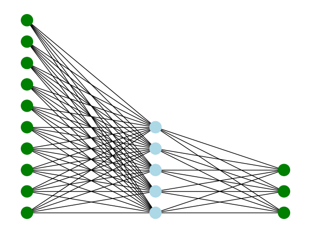

# SimpleNeuralNetwork

A simple project, to make _custom_ **multi-layer perceptron**

This project can be excecute in python, thanks to pybind11

Dependencies :

To realize matrix product as fast as possible
 - Eigen

To convert into Json :
 - nlohmann : https://github.com/nlohmann/json

To make Python module:
 - Pybind11
  
  